## Anglizismen

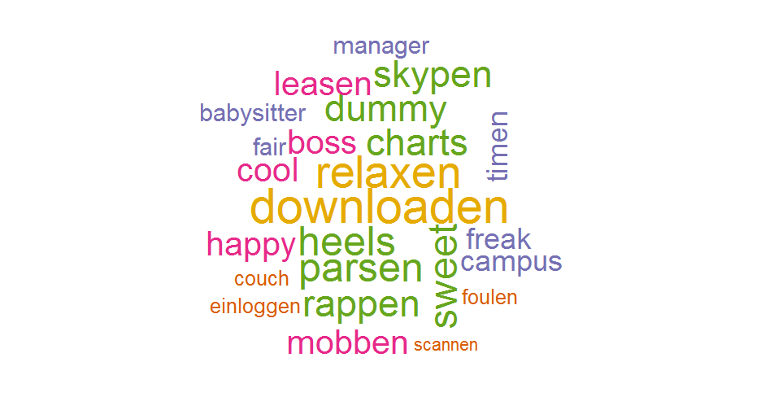 

---

## Deutsche Wörter im Englischen

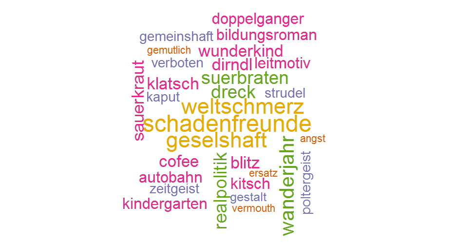 

--- 

## Angst

Englisch: Intensiver Angst oder innere Unruhe.  
  
Deutsch: sowohl in der Fachsprache der Psychologie und gemeinsame Sprache verwendet.  

    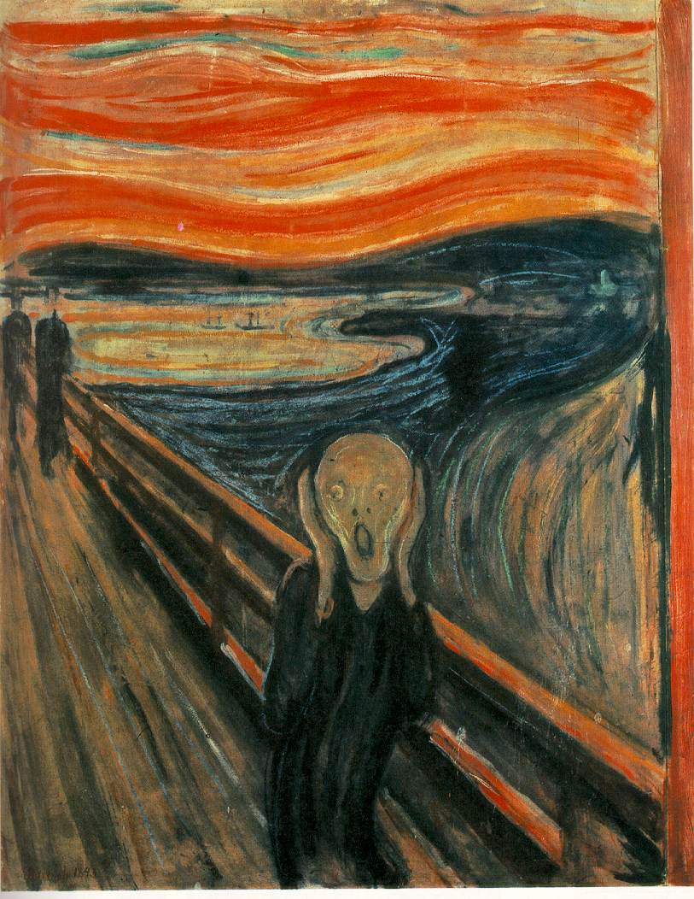

---

## Dreck

Englisch: Material ohne Qualitäts.  
  
Deutsch: Schmutz.  

    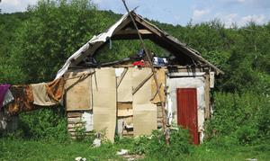

---

## Ersatz

Englisch: Vertretung, meist von minderer Qualität angesehen.  
  
Deutsch: Vertretung.  

    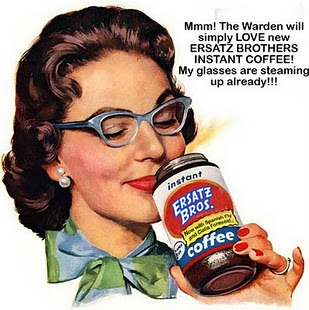

---

## Gestalt

Englisch: ganze Natur von etwas.  
  
Deutsch: Form.  

    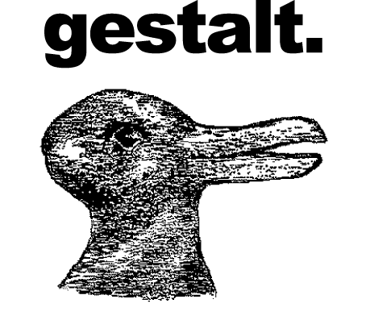

---

## Kaffeeklatsch

Englisch: Treffen, wo die Menschen beim Trinken Kaffee oder Tee trat≠schen.  
  
Deutsch: siehe oben.  

    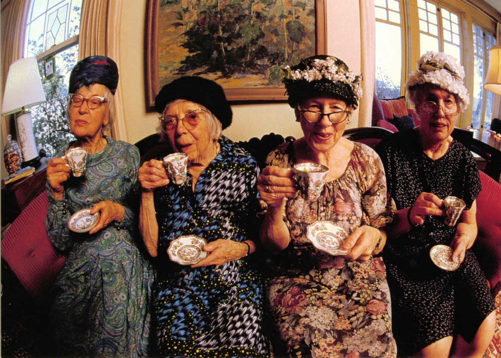

---

## Kitsch

Englisch: klebrig Stil von Massen Kunst oder Design mit populären oder kulturellen Ikonen.  
  
Deutsch: siehe oben.  

    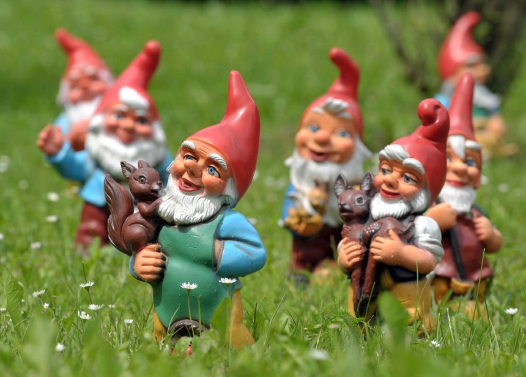

---

## Leitmotiv

Englisch: immer wiederkehrende musikalische Phrase.  
  
Deutsch: siehe oben, aber auch in der Literatur.  

    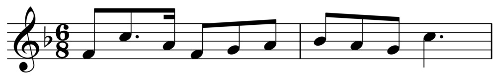

---

## Realpolitik

Englisch: Diplomatie basiert vor allem auf Macht, sondern als moralische oder ethische Ideen.  
  
Deutsch: Politik, die sich eng an den als real anerkannten Bedingungen und Möglichkeiten orientiert.

    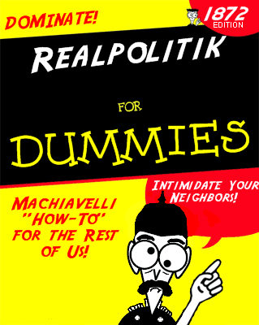

---

## Schadenfreude

Englisch: die Freude über das Missgeschick oder Unglück anderer.  

Deutsch: siehe oben.  

    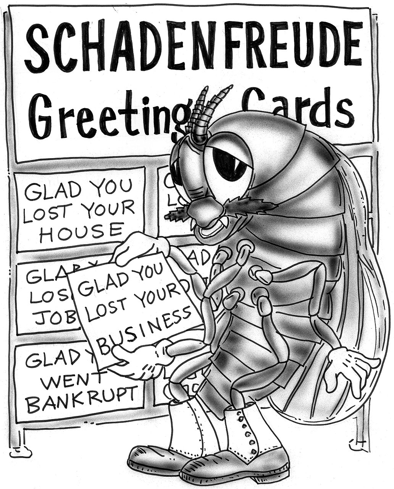

---

## Strudel

Englisch: Mehlspeise aus einer gefüllten und gebackenen oder gekochten Teigrolle.  

Deutsch: siehe oben.  

    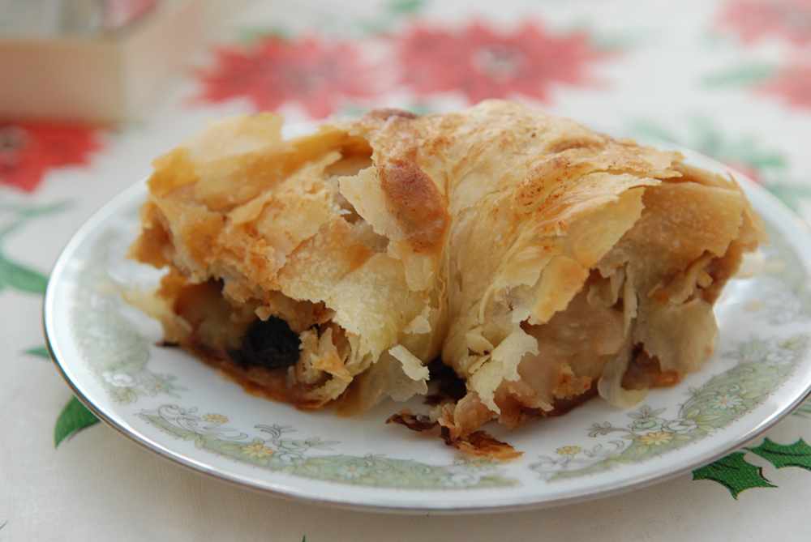

---

## Verboten

Englisch: untersagt, unerlaubt, hat autoritären Konnotationen.  

Deutsch: untersagt, unerlaubt.  

---

## Weltschmerz

Englisch: Gefühl der Trauer und schmerzhaft empfundener Melancholie, das jemand über seine eigene Unzulänglichkeit empfindet, die er zugleich als Teil der Unzulänglichkeit der Welt, der bestehenden Verhältnisse betrachtet.  

Deutsch: siehe oben.  

    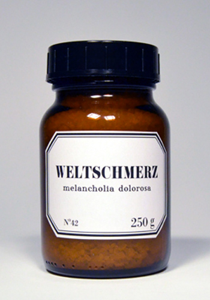

---

## Das Ende!

Vielen Dank für Ihre Aufmerksamkeit
